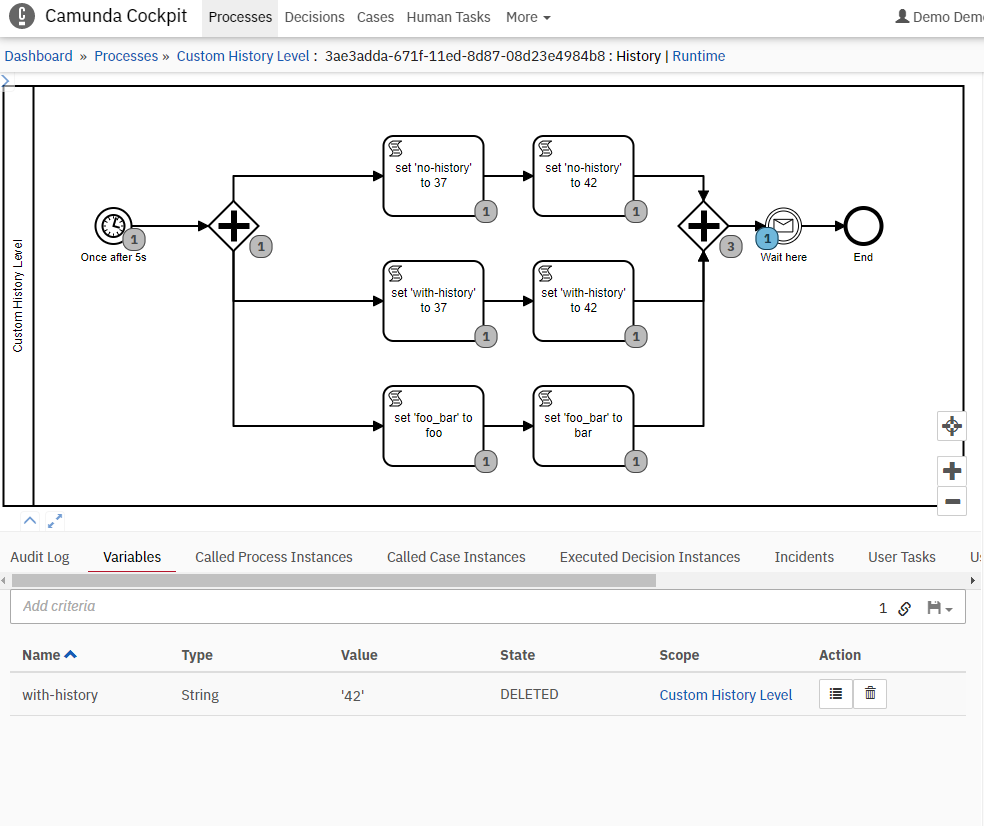

# custom-history-levels

This example show how to implement a custom history-level to exclude certain variables from being historized by Camunda.

## How to start
* Simply start the `ProcessApplication` and follow anything in the log, of may use the debugger.
* You can use the Enterprise-Edition (-ee) in order to have a look at historic variables using Camunda Cockpit

## How it works
Configuration is done in [application.yml](src/main/resources/application.yml):  
* Every variable starting with `prefix` is excluded from history
* Every variable in the list of `excluded-variables` is excluded directly
```yaml
de.viadee.bpm.camunda:
  history:
    exclusion-prefix: 'foo_'
    excluded-variables:
      - 'no-history'
```
The custom history level is enabled by 
```yaml
camunda.bpm:
  history-level: full-with-variable-exclusion
```

The custom history level is implemented by [HistoryLevelFullWithVariableExclusion.java](src/main/java/de/viadee/bpm/camunda/history/HistoryLevelFullWithVariableExclusion.java). 
The method `@Override method` `isHistoryEventProduced(..)` finally checks, if a history-event should be produced or not.

# How it looks

After the application has started, a process-instance is also started automatically. There are 3 parallel process-flows, 
that separately write different variables: `no-history`, `with-history`, and `foo_bar`.  
The following log appears: 
```
2022-11-18 10:04:13.141: HistoryEvent: VARIABLE_INSTANCE_CREATE for variable: 'no-history', isHistoryEventProduced: false 
2022-11-18 10:04:13.143: HistoryEvent: VARIABLE_INSTANCE_UPDATE for variable: 'no-history', isHistoryEventProduced: false 
2022-11-18 10:04:13.144: HistoryEvent: VARIABLE_INSTANCE_CREATE for variable: 'with-history', isHistoryEventProduced: true 
2022-11-18 10:04:13.145: HistoryEvent: VARIABLE_INSTANCE_UPDATE for variable: 'with-history', isHistoryEventProduced: true 
2022-11-18 10:04:13.147: HistoryEvent: VARIABLE_INSTANCE_CREATE for variable: 'foo_bar', isHistoryEventProduced: false 
2022-11-18 10:04:13.148: HistoryEvent: VARIABLE_INSTANCE_UPDATE for variable: 'foo_bar', isHistoryEventProduced: false 
```
* `no-history` is excluded directly by name
* `with-history` is not excluded
* `foo_bar` is excluded by the prefix

After deleting the 3 variables manually using Camunda Cockpit, there are 3 more logs:
```
2022-11-18 10:04:57.818: HistoryEvent: VARIABLE_INSTANCE_DELETE for variable: 'no-history', isHistoryEventProduced: false 
2022-11-18 10:05:09.336: HistoryEvent: VARIABLE_INSTANCE_DELETE for variable: 'foo_bar', isHistoryEventProduced: false 
2022-11-18 10:05:11.645: HistoryEvent: VARIABLE_INSTANCE_DELETE for variable: 'with-history', isHistoryEventProduced: true 
```
... and the process-instance looks like:  
  
Notice: There is only 1 variable left, because the others are excluded from _historization_  
