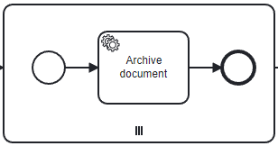

# Comparison - Delegate / Handler / Worker

This example compares the different implementations for regular `Java-Delegates`, `External-Task-Handler`
(based on the [official Spring Boot Starter](https://github.com/camunda/camunda-bpm-platform/tree/master/spring-boot-starter/starter-client) offered by Camunda)
,
and `Zeebe-Job-Worker` (also based on a [Zeebe Spring Boot Starter](https://github.com/camunda-community-hub/spring-zeebe) offered by Camunda).

Probably, you will not find all these three types simultaneously as part of the very same process application, especially `Zeebe-Job-Worker`
in combination with one of the others, since this type of implementation is used for Camunda 8, while the others work with
Camunda Platform 7. Though, this project shows how you can prepare your code in order to use [Clean Delegates](https://camunda.com/blog/2022/05/what-to-do-when-you-cant-quickly-migrate-to-camunda-8), that might
be easier migrated to `External-Tasks`, or even Camunda 8 `Job-Worker`,

## How to start

For this example application to run, it is necessary to have access to a Camunda 8 Cluster (maybe a trial environment).

### Required properties

* `Cluster-Id`
* `Cluster-Secret`
* `Client-Id`
* `Region`

These properties can be exported from the Camunda 8 cluster settings.
They need to be set as environment-properties in the following manner:

```yaml
cluster-id:    ${ZB_CLUSTER}
client-id:     ${ZB_CLIENT}
client-secret: ${ZB_SECRET}
region:        ${ZB_REGION}
```

Or you can of course set them directly into the [application.yml](src/main/resources/application.yml) (...but never commit secrets to git ;) )

Everything related to Camunda Platform 7 runs locally and in-memory - no credentials needed at all.

After set-up is finished, you can start the [Spring Boot Process Application](src/main/java/de/viadee/bpm/camunda/ProcessApplication.java).

## Start process-instances

By performing e.g. [the following http-request](demo/damage-report.http), the respective
[`RestController`](src/main/java/de/viadee/bpm/camunda/processinterface/ProcessStartRestController.java) is triggered
and 3 separate process-instances are started:

1. A process implemented using `Java-Delegates` (Camunda Platform 7)
2. A process implemented using `External-Tasks` (Camunda Platform 7)
3. A process implemented using `Zeebe-Job-Worker` (Camunda Platform 8)

But: The execution of all three process-instances rely on the very same [ProcessContext](src/main/java/de/viadee/bpm/camunda/processcontext/ProcessContext.java)-object as well as the identical business-logic!

## Features

* Separate auto-deployment for Camunda 7 and 8 process-models
* Writing process-variables as json
* Performing a multi-instance sub-process on a list of complex objects, and writing a result

### Auto-Deployment

The separated auto-deployments of resources for Camunda 8 resp. Camunda 7 are realized by some identifier as part of the process-model filenames.
Process-models that should be deployed to Camunda 7 have the extension `.cam.bpmn`, while Camunda 8 process-models use the extension `.zb.bpmn`.
With that, the resource-deployment-patterns are configured respectively:

##### Camunda 7, application.yml

```yaml
camunda.bpm:
  deployment-resource-pattern:
    - classpath*:**/*.cam.bpmn
```

##### Camunda 8, ProcessApplication.java

```java
@Deployment(resources = "classpath*:/**/*.zb.bpmn")
```

### Json to process-context

The shared data-types are part of the [model](src/main/java/model)-package, and they make use
of the mechanisms already shown in the [external-task-handler-json-variables](../external-task-handler-json-variables)-project.
All variables are stored as primitive or json-values, or as Object/ArrayList (in order to use this variable as collection for a multi-instance subprocess),
but in this case the List contains string values with escaped json-data that represents complex objects.

| Camunda 7                                          | Camunda 8                                          |
|----------------------------------------------------|----------------------------------------------------|
|  |  |


### Multi-instance

#### Java-Delegates

As part of the [ProcessContext](src/main/java/de/viadee/bpm/camunda/processcontext/ProcessContext.java), the `addArchivedDocument(..)`-method checks, if there
is already a list of results present. If so, the `archived`-element is added, otherwise a new List is instantiated. This mechanism builds on
the `OptimisticLocking` principle of Camunda: If there are 2 or more write-operations on one variable, all but one receive this type of error and will roll back
to try it
again until every instance was successful. By enabling the `Exclusive`-option in the process-model, this is very unlikely to happen,
but, if so: the 'Archive-Service' would be called twice or more.

```java
if(isNull(variableScope.getVariable(INT_ARCHIVED))){
  variableScope.setVariable(INT_ARCHIVED,JsonDataType.toJsonList(new ArrayList<>(List.of(archived))));
  }else{
  var archivedList=JsonDataType.fromList((List<String>)variableScope.getVariable(INT_ARCHIVED),Archived.class);
  archivedList.add(archived);
  variableScope.setVariable(INT_ARCHIVED,JsonDataType.toJsonList(archivedList));
  }
```

#### External-Tasks

As multi-instances implemented with external-tasks are very cumbersome, the multi-instance in this demo is simply changed to
sequential instead of parallel. This leads to the fact, that each multi-instance is executed after the previous one has finished,
so it is guaranteed only one execution inserts an element to the global result at a time.

| Parallel                                                      | Sequential                                                       |  
|---------------------------------------------------------------|------------------------------------------------------------------|
|   |  |

Another way could be to let the external-task-handler
`fetch&lock` only 1 task at a time (and not having multiple instances of this handler running of course), so that this handler can update
the global list of results in each execution, and will fetch already the updated list for the next task.

#### Zeebe-Worker

Fortunately, Camunda 8 supports handling of local results from sub-processes natively,
i.e. it is possible to join local result-variables into a list of objects without struggling with `OptimisticLocking` or
overwriting any previously stored result. Therefore, the respective process-model is configured in the following way:


* Input collection: The collection used for the multi-instance
* Input element: Name of the multi-instance-element in each iteration
* Output element: Local variable that is put into the Output collection
* Output collection: Name of the collection of joined output elements
